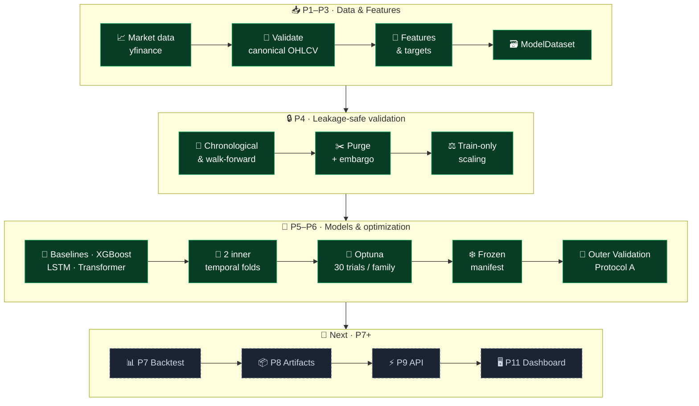
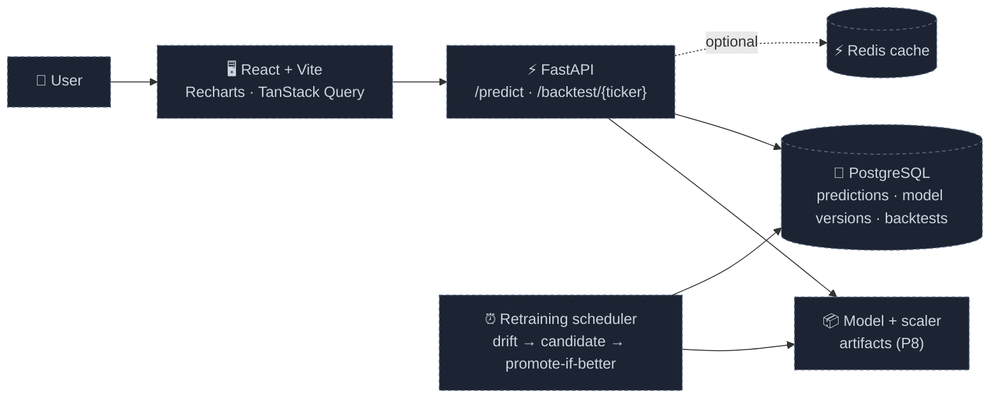
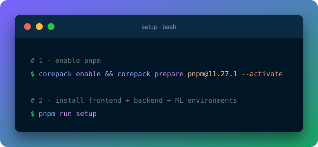
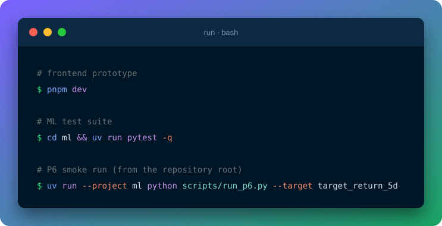
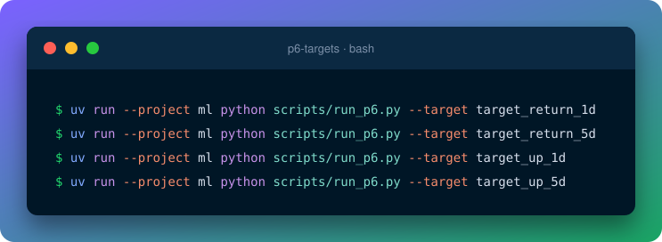

<div align="center">


<p>
  
  
  
  
</p>

### 🌐 [Live UI Prototype](https://delightful-conkies-82be02.netlify.app/)

</div>

> [!NOTE]
> The live UI is a **frontend prototype**. It is not connected to the ML pipeline or the FastAPI service yet.

---

## ✨ At a Glance

<div align="center">

| 🛡️ Leakage-safe | 🎯 Active targets | 🧠 Model families | ❄️ Frozen experiments |
|:-:|:-:|:-:|:-:|
| purge · embargo · train-only scaling | 1d & 5d · return & direction | XGBoost · LSTM · Transformer | 30 Optuna trials per family |

</div>

A multi-stock forecasting system that puts **correctness before deployment**: every split, scaler and search budget is locked, audited and reproducible before any number is reported.

---

## 🏛️ How It Works

<details open>
<summary><b>🟢 Current pipeline (P1 → P6)</b></summary>



</details>

<details>
<summary><b>🔵 Target architecture (P7 → P12) · planned</b></summary>



</details>

<details>
<summary><b>🔬 P6 protocol in one view</b></summary>

```text
P4 validated dataset
        ↓
Raw P6 search bundle
        ↓
2 inner temporal folds
  ├─ Fold 1: 60% fit / 20% selection
  └─ Fold 2: 80% fit / 20% selection
        ↓
Target-specific purge → train-only preprocessing per fold
        ↓
30 Optuna trials per family  (XGBoost · LSTM · Transformer)
        ↓
Lowest inner objective wins
        ↓
Frozen manifest written BEFORE Outer Validation opens
        ↓
Protocol A: fresh model · Fold 2 Inner Fit · early stopping on Fold 2 Inner Selection
        ↓
Evaluate once on Outer Validation
```

</details>

---

## 🎯 Targets & 🧠 Models

| 🎯 Target | 🧭 Task | ⏱️ Horizon | 🏁 Primary objective |
|:--|:--|:-:|:--|
| `target_return_1d` | 📉 Regression | 1 session | Relative RMSE |
| `target_return_5d` | 📉 Regression | 5 sessions | Relative RMSE |
| `target_up_1d` | 🧭 Classification | 1 session | LogLoss |
| `target_up_5d` | 🧭 Classification | 5 sessions | LogLoss |

> The old 20-session target is intentionally inactive.

| 🧪 Model | 🔑 Registry key | 🎯 Role | State |
|:--|:--|:--|:-:|
| 0️⃣ Naive zero | `baseline_zero` | Regression baseline | ✅ |
| 📊 Naive mean | `baseline_mean` | Regression baseline | ✅ |
| 🗳️ Naive majority | `baseline_majority` | Classification baseline | ✅ |
| 🌲 XGBoost | `xgboost` | Tree-based tabular model | ✅ |
| 🔁 LSTM | `lstm` | Sequence model | ✅ |
| 🧩 Transformer | `transformer` | Sequence model | ✅ |

<details>
<summary><b>🔎 P6 search spaces</b> (one matrix, all families)</summary>

<br>

| Parameter | 🌲 XGBoost | 🔁 LSTM | 🧩 Transformer |
|:--|:-:|:-:|:-:|
| `lookback` | n/a | 5 · 10 | 5 · 10 |
| depth / layers | `max_depth` 2–8 | `num_layers` 1–2 | `num_layers` 1–2 |
| width | n/a | `hidden_dim` 16 · 32 · 64 | `d_model` 16 · 32 · 64 |
| attention heads | n/a | n/a | `nhead` 2 · 4 |
| learning rate (log) | 1e-3 – 0.3 | 1e-4 – 1e-2 | 1e-4 – 1e-2 |
| dropout | n/a | 0.0 – 0.3 | 0.0 – 0.3 |
| `subsample` · `colsample_bytree` | 0.5 – 1.0 each | n/a | n/a |
| 🔒 fixed | 1000 trees · early stop 30 | 15 epochs | 15 epochs |

**Shared budget:** 30 trials · 10 startup trials · `TPESampler` · seed 42 · `n_jobs=1` · no pruning.

</details>

---

## 🔐 Leakage-Safe by Design

| 📅 Chronology | ✂️ Target-specific purge | ⚖️ Train-only scaling |
|:--|:--|:--|
| Splits follow session dates, never random sampling. | Rows whose label resolves on or after the boundary are dropped. Purge length follows the horizon (1d or 5d). | Scalers fit on the training slice only. Refitting is rejected. |

| 🔗 Sequence continuity | 🎯 Lookback alignment | 🔐 Outer Validation gate |
|:--|:--|:--|
| Purged rows stay as **feature-only history** for LSTM/Transformer windows. Their labels never train. | Lookbacks 5 and 10 score the same eligible rows. | Outer Validation can't be fetched until the P6 configuration is frozen. |

---

## ❄️ Frozen P6 Manifests

Four manifests, one per active target, are written **before** Outer Validation opens:

```text
p6_frozen_target_return_1d.json   p6_frozen_target_return_5d.json
p6_frozen_target_up_1d.json       p6_frozen_target_up_5d.json
```

<details>
<summary><b>📋 What's inside a manifest</b></summary>

<br>

- 🆔 experiment and target identity, winning model family and hyperparameters
- 🧬 feature schema and preprocessing configuration
- 🧱 inner-fold geometry, purge length, scoring and sequence-alignment rules
- 🛑 early-stopping and Protocol A rules
- 🎲 seed and determinism settings
- 📏 primary and secondary metrics, baseline definition
- 🔎 Optuna budget, sampler, search-space identity and retained trial metadata
- 🗃️ dataset manifest, library versions and code provenance

</details>

> [!WARNING]
> `scripts/run_p6.py` currently runs on a **synthetic development dataset** (random features, alternating labels) to validate the protocol. The manifests prove the pipeline is wired correctly. Winning families are placeholders, **not evidence of model quality**. The real `yfinance` path lives in `ml/data/` and is not yet used by the P6 runner.

---

## 🧰 Tech Stack

| 🖥️ Frontend | ⚡ Backend | 🧠 ML Engine |
|:-:|:-:|:-:|
|  |  |  |
| React 19 · Vite 8<br>TypeScript · Tailwind 4<br>Recharts · Lucide | FastAPI scaffold<br>Python 3.14 | PyTorch · scikit-learn<br>XGBoost · Optuna<br>TA-Lib · yfinance |

<div align="center">


**🔜 Planned:** 

</div>

<details>
<summary><b>📌 Pinned ML versions</b></summary>

<br>

```text
Python 3.14.7 · NumPy 2.5.3 · pandas 3.0.6 · SciPy 1.18.1 · scikit-learn 1.9.1
TA-Lib 0.8.1 · PyTorch 2.14.0 · XGBoost 3.4.1 · Optuna 5.0.0
```

</details>

---

## ⚙️ Quick Start & CLI

<div align="center">

**1️⃣ Set up**



**2️⃣ Run**



**3️⃣ Run P6 for every target**



</div>

<details>
<summary><b>📋 Copy-paste version</b></summary>

```bash
# set up
corepack enable && corepack prepare pnpm@11.27.1 --activate
pnpm run setup                      # pnpm install + uv sync for backend and ML

# run
pnpm dev                            # frontend prototype
cd ml && uv run pytest -q           # ML test suite

# P6 smoke run, from the repository root
uv run --project ml python scripts/run_p6.py --target target_return_1d
uv run --project ml python scripts/run_p6.py --target target_return_5d
uv run --project ml python scripts/run_p6.py --target target_up_1d
uv run --project ml python scripts/run_p6.py --target target_up_5d
```

Also available: `pnpm build` · `pnpm lint` · `pnpm typecheck` · `pnpm preview`

> 💡 Use **pnpm** only; `pnpm-lock.yaml` is the canonical lockfile. Use `pnpm run setup` (not `pnpm setup`, which is a built-in pnpm command). TA-Lib may need its native library installed on your platform. P6 requires exactly 30 trials and 10 startup trials.

</details>

---

## 📁 Project Structure

```text
📦 stock-market-prediction
│
├── 🖥️  frontend/              React 19 · Vite 8 · Tailwind · Recharts   (UI prototype)
├── ⚡  backend/               FastAPI scaffold                          (GET /health)
│
├── 🧠  ml/
│   ├── 📥 data/               yfinance ingest · validation · audit · universe
│   ├── 🧬 features/           returns · technicals · volatility · context · targets · dataset
│   ├── 🔒 validation/         chronological + walk-forward · purge/embargo · train-only scaling
│   ├── 🤖 models/             registry · baselines · XGBoost · LSTM · Transformer · metrics
│   ├── 🎯 optimization/       inner folds · Optuna search · frozen manifests · Outer gate
│   └── 🧪 tests/              leakage · purge · models · optimization · P6 regression
│
├── 🧪  scripts/run_p6.py      P6 runner (synthetic smoke dataset)
├── ❄️  p6_frozen_*.json       frozen P6 manifests, one per target
├── 📜  docs/updates/          milestone notes 000 → 003
├── 🖼️  docs/assets/           README code cards
├── 📊  data/                  local raw + processed data (git-ignored)
└── 📦  package.json           root pnpm scripts
```

| 🔍 Looking for… | 📍 Go to |
|:--|:--|
| Purge and embargo logic | `ml/validation/purging.py` |
| Train-only scaler | `ml/validation/preprocessor.py` |
| Splits and bundles | `ml/validation/split.py` |
| Search spaces and objectives | `ml/optimization/search.py` |
| Inner folds | `ml/optimization/folds.py` |
| Frozen manifest schema | `ml/optimization/manifest.py` |
| Outer Validation gate | `ml/optimization/outer_gate.py` |

---

## 🗺️ Roadmap

<div align="center">

| 🧠 ML research core | 📊 Evaluation & MLOps | 🚀 Product & platform |
|:--|:--|:--|
| 🟡 **P1** Data foundation<br>🟡 **P2** Features & targets<br>🟢 **P3** Dataset contract<br>🟢 **P4** Leakage-safe validation<br>🟢 **P5** Models<br>🟢 **P6** Optimization | 🔵 **P7** Evaluation & backtest<br>⚪ **P8** Artifacts & versioning<br>⚪ **P12** Drift & retraining | 🟡 **P9** FastAPI service<br>⚪ **P10** Database<br>🟡 **P11** React dashboard<br>⚪ **P13** Docker & CI/CD<br>🟡 **P14** Testing & quality |

🟢 **4** complete · 🟡 **5** in progress · 🔵 **1** next · ⚪ **4** planned

<sub>🟢 done · 🟡 partial · 🔵 next · ⚪ planned</sub>

</div>

<details>
<summary><b>🧭 Known gaps</b></summary>

<br>

- **P1:** the final Indian-market / NIFTY 50 pipeline is not built yet.
- **P2:** ATR / normalized ATR and dollar-volume features are not implemented. Cross-asset interfaces are partial.
- **P6:** no Optuna dashboard or persistent study storage. The Outer Validation gate is in-process only, with no persistent open-ledger. Family selection takes the lowest inner objective, with no baseline guard yet.
- **P6 data:** the smoke run uses synthetic data, so the real-data run comes with P7.
- **P9 / P11:** the API exposes only `/health`, and the dashboard uses static placeholder data.

❌ **Not claimed:** profitable trading performance, production serving, a frontend wired to the ML backend, or a completed backtest.

</details>

---

## 📜 Project Updates

<details>
<summary><b>📜 Update Log</b> (click to expand)</summary>

<br>

<details>
<summary>🔧 <b>Update 000</b> · npm → pnpm Migration</summary>

<br>

- JavaScript tooling moved from npm to pnpm.
- `pnpm-lock.yaml` became the canonical lockfile.

📖 **[Read the full update →](docs/updates/000-pnpm-migration.md)**

</details>

<details>
<summary>🚀 <b>Update 001</b> · ML Data Foundation</summary>

<br>

- Established the ML data-ingestion, target, feature and dataset-builder foundation.
- Added canonical market-data normalization and validation around `yfinance` data.

📖 **[Read the full update →](docs/updates/001-ml-forecasting-foundation.md)**

</details>

<details>
<summary>🧠 <b>Update 002</b> · Phase 5 Modeling Infrastructure</summary>

<br>

- Added the model registry and training infrastructure for baselines, XGBoost, LSTM and Transformer.
- Added fold-level validation aggregation and reproducibility controls.
- Added binary classification support for the sequence models.

📖 **[Read the full update →](docs/updates/002-phase5-modeling.md)**

</details>

<details>
<summary>❄️ <b>Update 003</b> · Phase 6 Optimization & Frozen Experiments</summary>

<br>

- Locked two inner temporal folds, target-specific purge and train-only preprocessing for the search path.
- Locked Optuna to 30 trials, 10 startup trials, seed 42, TPE, `n_jobs=1` and no pruning.
- Non-finite predictions or losses now invalidate the trial instead of being silently dropped.
- Added search-space identity, frozen manifests and an Outer Validation gate that opens only after the freeze.
- Ran P6 for all four active targets on the synthetic smoke dataset and kept the frozen manifests.

📖 **[Read the full update →](docs/updates/003-phase6-optimization.md)**

</details>

</details>

---

<details>
<summary><b>🧠 Engineering Principles & Notes</b> (click to expand)</summary>

<br>

- 🎯 **Correctness before performance:** low training loss is not success.
- 🛡️ **No leakage:** future information never enters the training path.
- ⏳ **Time-aware validation:** chronological, never random.
- 🧊 **Frozen selection boundary:** Outer Validation is not a tuning set.
- 🧪 **Fresh model per fold:** no learned state crosses temporal folds.
- 🔢 **Numerical validity:** non-finite values invalidate the affected trial.
- ♻️ **Reproducibility:** seeds, versions, search spaces and manifests are retained.
- 🧱 **Separation of concerns:** data, ML, backend and frontend stay independently testable.

**Data note:** raw market datasets are generated locally and excluded from version control. The initial universe is a development universe.

</details>

<div align="center">

<br>

**📈 Market data → validation → models → frozen experiments → evaluation → backtesting → serving**

### 🚦 Current milestone: **P6 complete · P7 next**


</div>
