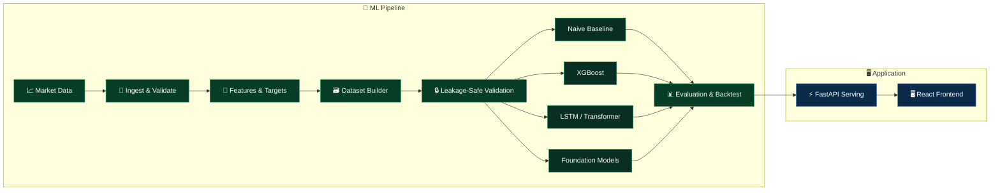

<div align="center">

# 📈 Stock Market Prediction

**A multi-layer stock forecasting system: React frontend · FastAPI backend · Python ML pipeline**

<p>
  <a href="https://react.dev/"></a>
  <a href="https://fastapi.tiangolo.com/"></a>
  <a href="https://www.python.org/"></a>
  <a href="https://pnpm.io/"></a>
  <a href="https://docs.astral.sh/uv/"></a>
</p>

### 🌐 [Live Application](https://delightful-conkies-82be02.netlify.app/)

</div>

---

## 🧭 What Is This?

A forecasting system built toward **multi-stock prediction**, with reproducible data pipelines, leakage-safe validation, measurable out-of-sample evaluation, and a clean split between data, ML, backend and frontend.

---

## 🔄 How It Works



---

## 🧰 Tech Stack

| 🖥️ Frontend | ⚡ Backend | 🧠 ML | 📈 Data | 📦 Tooling |
|:-:|:-:|:-:|:-:|:-:|
| React + Vite | FastAPI | Python | `yfinance` | `pnpm` · `uv` |

---

## ⚙️ Quick Start

```bash
corepack enable && corepack prepare pnpm@11.27.1 --activate   # or install pnpm 11 directly
pnpm install                        # frontend deps
uv sync --directory backend         # backend env
uv sync --project ml                # ML env

pnpm dev                            # start the frontend
```

Also available: `pnpm build` · `pnpm lint` · `pnpm preview`

> 💡 Use **pnpm** only. Don't commit `package-lock.json`; `pnpm-lock.yaml` is the canonical lockfile.

---

## 📁 Project Structure

```text
📦 stock-market-prediction/
├── 🖥️ frontend/    → React + Vite app
├── ⚡ backend/     → FastAPI service
├── 🧠 ml/          → data · features · models · training · evaluation
├── 📊 data/        → local datasets & markers
├── 📚 docs/        → engineering notes (docs/updates/)
└── 📖 README.md
```

---

## 📊 Development Status

**3 / 9 milestones done** · `🟩🟩🟩⬜⬜⬜⬜⬜⬜`

| Phase | Covers | Status |
|:------|:-------|:------:|
| 📊 Data & Features | Data foundation, target/feature foundation | ✅ Done |
| 🗃️ Dataset Builder | Features + targets + metadata | ✅ Done |
| 🔒 Validation | Leakage-safe, chronological splits | 🔜 Next |
| 🤖 Modeling | Model training, forecasting evaluation, backtesting | ⏳ Pending |
| 🔌 Integration | API integration, frontend ML integration | ⏳ Pending |

---

## 📜 Project Updates

<details>
<summary><b>📜 Update Log</b> (click to expand)</summary>

<br>

<details>
<summary>🔧 <b>Update 000</b> · npm → pnpm Migration</summary>

<br>

- **What:** JavaScript tooling moved from npm to pnpm.
- **Result:** `pnpm-lock.yaml` is now the canonical lockfile.

📖 **[Read the full update →](docs/updates/000-pnpm-migration.md)**

</details>

<details>
<summary>🚀 <b>Update 001</b> · ML Data Foundation</summary>

<br>

- **What:** Initial ML data foundation established.
- **Result:** Supports the data, target, feature and dataset-builder stages in the pipeline above.

📖 **[Read the full update →](docs/updates/001-ml-forecasting-foundation.md)**

</details>

</details>

---

<details>
<summary><b>🧠 Engineering Principles & Notes</b> (click to expand)</summary>

<br>

- **Reproducibility:** data prep and ML workflows should be repeatable.
- **No leakage:** nothing available after the prediction cutoff may enter a training example.
- **Time-aware validation:** chronological evaluation over random splits.
- **Measurable performance:** changes backed by out-of-sample evaluation.
- **Separation of concerns:** data, ML, backend and frontend stay separate.

**Notes:** the initial market-data universe is a development universe. Raw market datasets are generated locally and kept out of version control.

</details>

---

<div align="center">

**📈 Market data → features → models → evaluation → forecasting**

</div>
